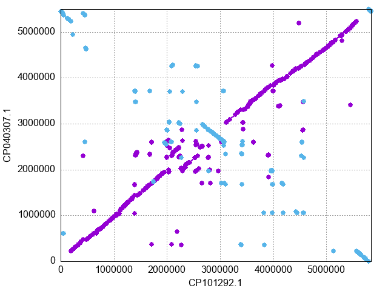
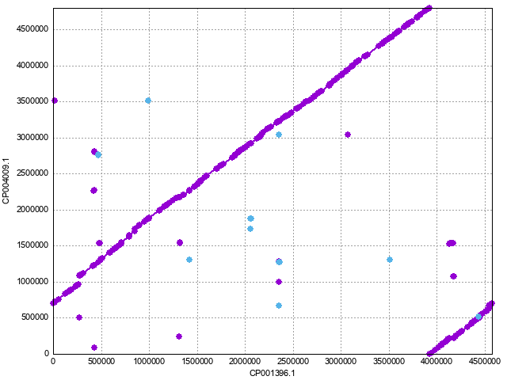
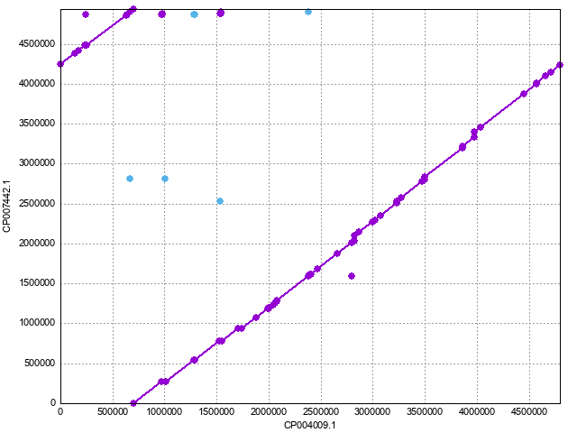
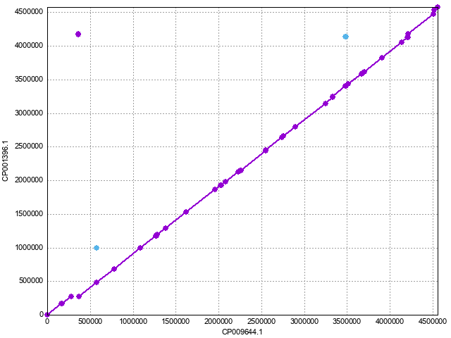
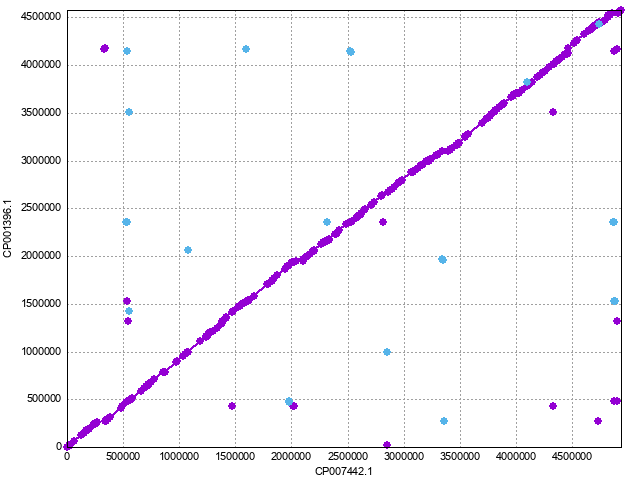

# Ecoli Strains selection

genomic data was downloaded from [NCBI](https://www.ncbi.nlm.nih.gov/genome/browse#!/prokaryotes/167/). 

The idea is to select four e.coli strains in order to build paternal, maternal, and kids haplotypes.

## E.coli strains 2003-3014 and F1 E4

Average identity ***97.55*** plus several SVs (image1.png).

- Escherichia coli strain 2003-3014 (CP101292.1) paternal
- Escherichia coli strain F1 E4 (CP040307) maternal

###  whole genome comparison alignment (dnadiff)

```
                               [CP101292.1]       [CP040307]
[Sequences]
TotalSeqs                          1                    1
AlignedSeqs               1(100.00%)           1(100.00%)
UnalignedSeqs               0(0.00%)             0(0.00%)

[Bases]
TotalBases                   5840137              5496151
AlignedBases         5012832(85.83%)      4871237(88.63%)
UnalignedBases        827305(14.17%)       624914(11.37%)

[Alignments]
1-to-1                           477                  477
TotalLength                  4724919              4724595
AvgLength                    9905.49              9904.81
AvgIdentity                    97.94                97.94

M-to-M                           938                  938
TotalLength                  5408040              5407723
AvgLength                    5765.50              5765.16
AvgIdentity                    97.55                97.55

[Feature Estimates]
Breakpoints                     1874                 1874
Relocations                      131                  143
Translocations                     0                    0
Inversions                        70                   68

Insertions                       749                  561
InsertionSum                 1252866               885647
InsertionAvg                 1672.72              1578.69

TandemIns                          3                    5
TandemInsSum                     718                  660
TandemInsAvg                  239.33               132.00

[SNPs]
TotalSNPs                      87246                87246
```

### genome plot (mummerplot)
<!-- -->


## E.coli strains BW2952 and APEC O78

Average identity **98.70** no SVs.

- Escherichia coli BW2952 (CP001396.1) paternal 
- Escherichia coli APEC O78 (CP004009) maternal


###  whole genome comparison alignment (dnadiff)

```
                               [CP001396.1]      [CP004009]
[Sequences]
TotalSeqs                          1                    1
AlignedSeqs               1(100.00%)           1(100.00%)
UnalignedSeqs               0(0.00%)             0(0.00%)

[Bases]
TotalBases                   4578159              4798435
AlignedBases         4291796(93.75%)      4296259(89.53%)
UnalignedBases         286363(6.25%)       502176(10.47%)

[Alignments]
1-to-1                           250                  250
TotalLength                  4255961              4255679
AvgLength                   17023.84             17022.72
AvgIdentity                    98.70                98.70

M-to-M                           391                  391
TotalLength                  4386918              4386528
AvgLength                   11219.74             11218.74
AvgIdentity                    98.63                98.63

[Feature Estimates]
Breakpoints                      780                  780
Relocations                       56                   78
Translocations                     0                    0
Inversions                        18                   18

Insertions                       280                  265
InsertionSum                  342307               581148
InsertionAvg                 1222.53              2193.01

TandemIns                          6                    5
TandemInsSum                    1046                  752
TandemInsAvg                  174.33               150.40

[SNPs]
TotalSNPs                      51001                51001
```


### genome plot (mummerplot)
<!-- -->

## E.coli strains APEC O78 and ACN001 (paternal haplotypes)

Average identity **99.9** no SVs 

- Escherichia coli APEC O78 (CP004009) paternal A
- Escherichia coli ACN001 (CP007442.1) paternal B
 
 
###  whole genome comparison alignment (dnadiff)


```
                               [CP004009.1]       [CP007442.1]
[Sequences]
TotalSeqs                          1                    1
AlignedSeqs               1(100.00%)           1(100.00%)
UnalignedSeqs               0(0.00%)             0(0.00%)

[Bases]
TotalBases                   4798435              4936576
AlignedBases         4672551(97.38%)      4662853(94.46%)
UnalignedBases         125884(2.62%)        273723(5.54%)

[Alignments]
1-to-1                            60                   60
TotalLength                  4664831              4664928
AvgLength                   77747.18             77748.80
AvgIdentity                    99.95                99.95

M-to-M                           125                  125
TotalLength                  4770354              4770614
AvgLength                   38162.83             38164.91
AvgIdentity                    99.90                99.90

[Feature Estimates]
Breakpoints                      248                  248
Relocations                       24                   25
Translocations                     0                    0
Inversions                        10                   10

Insertions                        98                   72
InsertionSum                  184438               321974
InsertionAvg                 1882.02              4471.86

TandemIns                          2                    4
TandemInsSum                     138                  616
TandemInsAvg                   69.00               154.00

[SNPs]
TotalSNPs                       1755                 1755
```
 
 
### genome plot (mummerplot)
<!-- -->


## E.coli strains BW2952 and ER2796 (maternal haplotypes)

Average identity **99.98** no SVs 

- Escherichia coli BW2952 (CP001396.1) maternal A
- Escherichia coli ER2796 (CP009644.1) maternal B
 
###  whole genome comparison alignment (dnadiff)

```
                               [REF]                [QRY]
[Sequences]
TotalSeqs                          1                    1
AlignedSeqs               1(100.00%)           1(100.00%)
UnalignedSeqs               0(0.00%)             0(0.00%)

[Bases]
TotalBases                   4558663              4578159
AlignedBases         4449275(97.60%)      4454615(97.30%)
UnalignedBases         109388(2.40%)        123544(2.70%)

[Alignments]
1-to-1                            36                   36
TotalLength                  4459752              4459776
AvgLength                  123882.00            123882.67
AvgIdentity                    99.98                99.98

M-to-M                            71                   71
TotalLength                  4498678              4498744
AvgLength                   63361.66             63362.59
AvgIdentity                    99.97                99.97

[Feature Estimates]
Breakpoints                      140                  140
Relocations                       14                   11
Translocations                     0                    0
Inversions                         4                    4

Insertions                        29                   39
InsertionSum                  125749               146684
InsertionAvg                 4336.17              3761.13

TandemIns                          0                    3
TandemInsSum                       0                  394
TandemInsAvg                    0.00               131.33

[SNPs]
TotalSNPs                        621                  621
```

### genome plot (mummerplot)
<!-- -->


## E.coli strains BW2952 and ACN001 (kids haplotypes)

Average identity **98.61** no SVs 

- Escherichia coli BW2952 (CP001396.1) kid A (maternal)
- Escherichia coli ACN001 (CP007442.1) Kid B (paternal)

###  whole genome comparison alignment (dnadiff)

```
                               [CP007442.1]     [CP001396.1]
[Sequences]
TotalSeqs                          1                    1
AlignedSeqs               1(100.00%)           1(100.00%)
UnalignedSeqs               0(0.00%)             0(0.00%)

[Bases]
TotalBases                   4936576              4578159
AlignedBases         4307594(87.26%)      4304120(94.01%)
UnalignedBases        628982(12.74%)        274039(5.99%)

[Alignments]
1-to-1                           261                  261
TotalLength                  4275550              4275733
AvgLength                   16381.42             16382.12
AvgIdentity                    98.67                98.67

M-to-M                           379                  379
TotalLength                  4368316              4368589
AvgLength                   11525.90             11526.62
AvgIdentity                    98.61                98.61

[Feature Estimates]
Breakpoints                      757                  757
Relocations                       73                   50
Translocations                     0                    0
Inversions                        28                   28

Insertions                       250                  284
InsertionSum                  676950               322221
InsertionAvg                 2707.80              1134.58

TandemIns                          5                    5
TandemInsSum                     691                  783
TandemInsAvg                  138.20               156.60

[SNPs]
TotalSNPs                      51994                51994
```

### genome plot (mummerplot)
<!-- -->

# Conclusion

The strains selected to represent paternal, maternal, and kids haplotypes are:

1. Maternal Haplotypes (99.98% identity)
	- Escherichia coli BW2952 (CP001396.1) maternal A
	- Escherichia coli ER2796 (CP009644.1) maternal B

2. Paternal Haplotypes (99.9% identity)
	- Escherichia coli APEC O78 (CP004009) paternal A
	- Escherichia coli ACN001 (CP007442.1) paternal B
	
3. kids haplotypes (98.61% identity)
	- Escherichia coli BW2952 (CP001396.1) kid A (maternal)
	- Escherichia coli ACN001 (CP007442.1) Kid B (paternal)