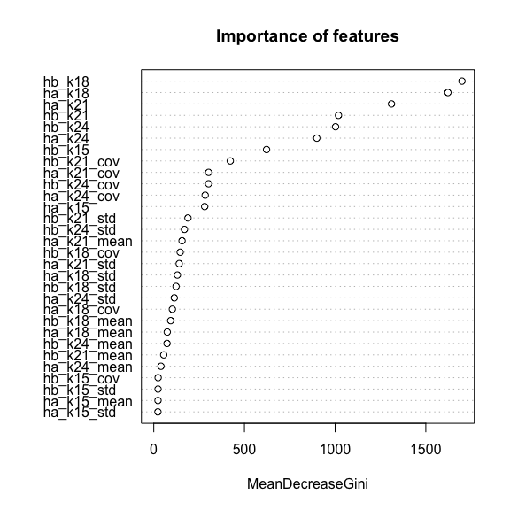
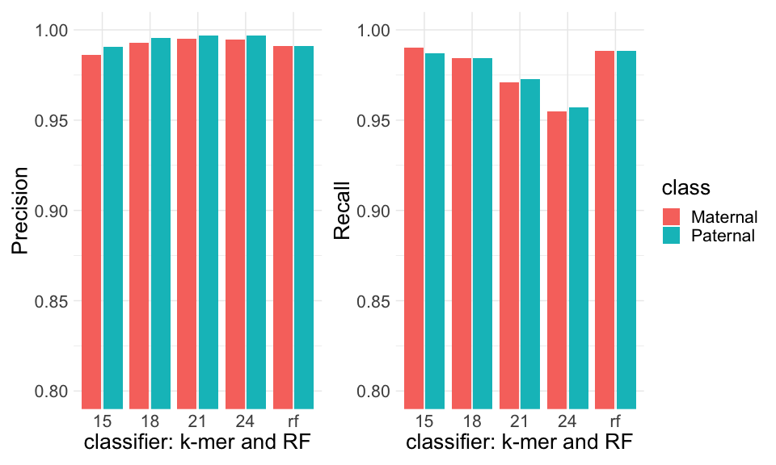

TrioRF
================
Alex Di Genova
2022-09-26

## Load data

we load the matrix generated with the python code

``` r
r=read.table("../classification/kidONT.R94.kmers.txt",h=T)
```

## Real clases

we do add the real clases to the data

``` r
library(tidyverse)
```

    ## ── Attaching packages ─────────────────────────────────────── tidyverse 1.3.2 ──
    ## ✔ ggplot2 3.4.0      ✔ purrr   1.0.0 
    ## ✔ tibble  3.1.8      ✔ dplyr   1.0.10
    ## ✔ tidyr   1.2.1      ✔ stringr 1.5.0 
    ## ✔ readr   2.1.3      ✔ forcats 0.5.2 
    ## ── Conflicts ────────────────────────────────────────── tidyverse_conflicts() ──
    ## ✖ dplyr::filter() masks stats::filter()
    ## ✖ dplyr::lag()    masks stats::lag()

``` r
r=r %>% mutate(class=if_else(startsWith(id,"K1"),"B","A")) 
```

## Baseline classification tool

This is how currently is performed the classification of
paternal/maternal haplotypes which is based on the hits for each mer.

``` doc
def compute_scaling_factors():
    num_kmers_a = kmers.get_number_kmers_in_set(haplotype_a_kmers)
    num_kmers_b = kmers.get_number_kmers_in_set(haplotype_b_kmers)
    max_num_kmers = max(num_kmers_a, num_kmers_b)
    scaling_factor_a = 1.0 * max_num_kmers / num_kmers_a
    scaling_factor_b = 1.0 * max_num_kmers / num_kmers_b
    return scaling_factor_a, scaling_factor_b
    
# determine the class
  hap_a_score = hap_a_count * scaling_factor_a
  hap_b_score = hap_b_count * scaling_factor_b

   if hap_a_score > hap_b_score:
     read_bin = "A"
  
  elif hap_b_score > hap_a_score:
        read_bin = "B"
   else:
    read_bin = "U"
   
```

we do implement the same strategy for R code

``` r
library(caret)
```

    ## Loading required package: lattice

    ## 
    ## Attaching package: 'caret'

    ## The following object is masked from 'package:purrr':
    ## 
    ##     lift

``` r
nk_hapa=c(1348958,1548667,1674112,1791266)
nk_hapb=c(963463,1138714,1262662,1376492)
sf_a=c(1,1,1,1)
sf_b=nk_hapa/nk_hapb
#k_15
r_k15=r %>% select(id,ha_k15,hb_k15,class) %>% 
  mutate(scoreA=ha_k15*sf_a[1],scoreB=hb_k15*sf_b[1], classp=if_else(scoreA > scoreB, "A",if_else(scoreA == scoreB, "U","B")))
r_k15[nrow(r_k15) + 1,] = c("dummy",0,0,"U",0,0,"U")
mk15=confusionMatrix(factor(r_k15$classp),factor(r_k15$class))
mk15
```

    ## Confusion Matrix and Statistics
    ## 
    ##           Reference
    ## Prediction     A     B     U
    ##          A 15798   150     0
    ##          B   205 14780     0
    ##          U     0     0     1
    ## 
    ## Overall Statistics
    ##                                           
    ##                Accuracy : 0.9885          
    ##                  95% CI : (0.9873, 0.9897)
    ##     No Information Rate : 0.5173          
    ##     P-Value [Acc > NIR] : < 2.2e-16       
    ##                                           
    ##                   Kappa : 0.977           
    ##                                           
    ##  Mcnemar's Test P-Value : NA              
    ## 
    ## Statistics by Class:
    ## 
    ##                      Class: A Class: B  Class: U
    ## Sensitivity            0.9872   0.9900 1.000e+00
    ## Specificity            0.9900   0.9872 1.000e+00
    ## Pos Pred Value         0.9906   0.9863 1.000e+00
    ## Neg Pred Value         0.9863   0.9906 1.000e+00
    ## Prevalence             0.5173   0.4826 3.233e-05
    ## Detection Rate         0.5107   0.4778 3.233e-05
    ## Detection Prevalence   0.5155   0.4844 3.233e-05
    ## Balanced Accuracy      0.9886   0.9886 1.000e+00

``` r
r_k18=r %>% select(id,ha_k18,hb_k18,class) %>% 
  mutate(scoreA=ha_k18*sf_a[2],scoreB=hb_k18*sf_b[2], classp=if_else(scoreA > scoreB, "A",if_else(scoreA == scoreB, "U","B")))
#we add a dummy class for classification purposes
r_k18[nrow(r_k18) + 1,] = c("dummy",0,0,"U",0,0,"U")
mk18=confusionMatrix(factor(r_k18$classp),factor(r_k18$class))
mk18
```

    ## Confusion Matrix and Statistics
    ## 
    ##           Reference
    ## Prediction     A     B     U
    ##          A 15750    73     0
    ##          B   103 14697     0
    ##          U   150   160     1
    ## 
    ## Overall Statistics
    ##                                           
    ##                Accuracy : 0.9843          
    ##                  95% CI : (0.9828, 0.9856)
    ##     No Information Rate : 0.5173          
    ##     P-Value [Acc > NIR] : < 2.2e-16       
    ##                                           
    ##                   Kappa : 0.9689          
    ##                                           
    ##  Mcnemar's Test P-Value : < 2.2e-16       
    ## 
    ## Statistics by Class:
    ## 
    ##                      Class: A Class: B  Class: U
    ## Sensitivity            0.9842   0.9844 1.000e+00
    ## Specificity            0.9951   0.9936 9.900e-01
    ## Pos Pred Value         0.9954   0.9930 3.215e-03
    ## Neg Pred Value         0.9833   0.9856 1.000e+00
    ## Prevalence             0.5173   0.4826 3.233e-05
    ## Detection Rate         0.5091   0.4751 3.233e-05
    ## Detection Prevalence   0.5115   0.4784 1.005e-02
    ## Balanced Accuracy      0.9897   0.9890 9.950e-01

``` r
#k21 is used in trio-binnig

r_k21=r %>% select(id,ha_k21,hb_k21,class) %>% 
  mutate(scoreA=ha_k21*sf_a[3],scoreB=hb_k21*sf_b[3], classp=if_else(scoreA > scoreB, "A",if_else(scoreA == scoreB, "U","B")))
#we add a dummy class for classification purposes
r_k21[nrow(r_k21) + 1,] = c("dummy",0,0,"U",0,0,"U")
mk21=confusionMatrix(factor(r_k21$classp),factor(r_k21$class))
mk21
```

    ## Confusion Matrix and Statistics
    ## 
    ##           Reference
    ## Prediction     A     B     U
    ##          A 15569    46     0
    ##          B    71 14498     0
    ##          U   363   386     1
    ## 
    ## Overall Statistics
    ##                                           
    ##                Accuracy : 0.972           
    ##                  95% CI : (0.9701, 0.9738)
    ##     No Information Rate : 0.5173          
    ##     P-Value [Acc > NIR] : < 2.2e-16       
    ##                                           
    ##                   Kappa : 0.9453          
    ##                                           
    ##  Mcnemar's Test P-Value : < 2.2e-16       
    ## 
    ## Statistics by Class:
    ## 
    ##                      Class: A Class: B  Class: U
    ## Sensitivity            0.9729   0.9711 1.000e+00
    ## Specificity            0.9969   0.9956 9.758e-01
    ## Pos Pred Value         0.9971   0.9951 1.333e-03
    ## Neg Pred Value         0.9717   0.9736 1.000e+00
    ## Prevalence             0.5173   0.4826 3.233e-05
    ## Detection Rate         0.5033   0.4687 3.233e-05
    ## Detection Prevalence   0.5048   0.4710 2.425e-02
    ## Balanced Accuracy      0.9849   0.9833 9.879e-01

``` r
r_k24=r %>% select(id,ha_k24,hb_k24,class) %>% 
  mutate(scoreA=ha_k24*sf_a[4],scoreB=hb_k24*sf_b[4], classp=if_else(scoreA > scoreB, "A",if_else(scoreA == scoreB, "U","B")))
#we add a dummy class for classification purposes
r_k24[nrow(r_k24) + 1,] = c("dummy",0,0,"U",0,0,"U")
mk24=confusionMatrix(factor(r_k24$classp),factor(r_k24$class))
mk24
```

    ## Confusion Matrix and Statistics
    ## 
    ##           Reference
    ## Prediction     A     B     U
    ##          A 15315    48     0
    ##          B    75 14253     0
    ##          U   613   629     1
    ## 
    ## Overall Statistics
    ##                                           
    ##                Accuracy : 0.9559          
    ##                  95% CI : (0.9535, 0.9581)
    ##     No Information Rate : 0.5173          
    ##     P-Value [Acc > NIR] : < 2.2e-16       
    ##                                           
    ##                   Kappa : 0.9151          
    ##                                           
    ##  Mcnemar's Test P-Value : < 2.2e-16       
    ## 
    ## Statistics by Class:
    ## 
    ##                      Class: A Class: B  Class: U
    ## Sensitivity            0.9570   0.9547 1.000e+00
    ## Specificity            0.9968   0.9953 9.598e-01
    ## Pos Pred Value         0.9969   0.9948 8.045e-04
    ## Neg Pred Value         0.9558   0.9592 1.000e+00
    ## Prevalence             0.5173   0.4826 3.233e-05
    ## Detection Rate         0.4951   0.4608 3.233e-05
    ## Detection Prevalence   0.4966   0.4632 4.018e-02
    ## Balanced Accuracy      0.9769   0.9750 9.799e-01

## Random forest classifier

### model build

``` r
library(randomForest)
```

    ## randomForest 4.7-1.1

    ## Type rfNews() to see new features/changes/bug fixes.

    ## 
    ## Attaching package: 'randomForest'

    ## The following object is masked from 'package:dplyr':
    ## 
    ##     combine

    ## The following object is masked from 'package:ggplot2':
    ## 
    ##     margin

``` r
library(caret)
library(e1071)
library(caTools)

feats=colnames(r)[2:length(r)]
rs=r[,feats]
ca=r[r$class=="A",]
cb=r[r$class=="B",]
ca=ca[sample(nrow(cb),nrow(cb)),]
rs=rbind(ca,cb)
rs=r[,feats]

rs$class=factor(rs$class)
sample = sample.split(rs$class, SplitRatio = 0.75)
train = subset(rs, sample == TRUE) # 75% training
test  = subset(rs, sample == FALSE) # 25% for evaluation
dim(train)
```

    ## [1] 23200    33

``` r
dim(test)
```

    ## [1] 7733   33

``` r
rf <- randomForest(
  class ~ .,
  #importance=T,
  data=train,
  keep.forest = TRUE
  )
```

### model evaluation

``` r
#we make the predictions
pred = predict(rf, newdata=test)
m=confusionMatrix(pred, test$class)
varImpPlot(rf,main="Importance of features")
```

<!-- -->

we build a consolidate plot by k-mer, random forest and class

``` r
library(knitr)
s=mk15$byClass[,5:7]
s=rbind(s,mk18$byClass[,5:7])
s=rbind(s,mk21$byClass[,5:7])
s=rbind(s,mk24$byClass[,5:7])
s=rbind(s,m$byClass[5:7])
s=rbind(s,m$byClass[5:7])
sd=as.data.frame(s)
sd$k=c(rep(15,3),rep(18,3),rep(21,3),rep(24,3),rep("rf",2))
sd$class=c(rep(c("Paternal","Maternal","U"),4),c("Paternal","Maternal"))
kable(sd,caption = "Precision, recall and F1 for haplotype classifiers")
```

|            | Precision |    Recall |        F1 | k   | class    |
|:-----------|----------:|----------:|----------:|:----|:---------|
| Class..A   | 0.9905944 | 0.9871899 | 0.9888892 | 15  | Paternal |
| Class..B   | 0.9863197 | 0.9899531 | 0.9881330 | 15  | Maternal |
| Class..U   | 1.0000000 | 1.0000000 | 1.0000000 | 15  | U        |
| Class..A.1 | 0.9953865 | 0.9841905 | 0.9897568 | 18  | Paternal |
| Class..B.1 | 0.9930405 | 0.9843938 | 0.9886983 | 18  | Maternal |
| Class..U.1 | 0.0032154 | 1.0000000 | 0.0064103 | 18  | U        |
| Class..A.2 | 0.9970541 | 0.9728801 | 0.9848188 | 21  | Paternal |
| Class..B.2 | 0.9951266 | 0.9710650 | 0.9829486 | 21  | Maternal |
| Class..U.2 | 0.0013333 | 1.0000000 | 0.0026631 | 21  | U        |
| Class..A.3 | 0.9968756 | 0.9570081 | 0.9765351 | 24  | Paternal |
| Class..B.3 | 0.9947655 | 0.9546551 | 0.9742976 | 24  | Maternal |
| Class..U.3 | 0.0008045 | 1.0000000 | 0.0016077 | 24  | U        |
| X          | 0.9909797 | 0.9885029 | 0.9897397 | rf  | Paternal |
| X.1        | 0.9909797 | 0.9885029 | 0.9897397 | rf  | Maternal |

Precision, recall and F1 for haplotype classifiers

we make the plots

``` r
library(patchwork)
p1=sd %>% filter(class != "U") %>% ggplot(aes(y=Precision, x=factor(k),fill=class)) + 
  geom_col(position="dodge2") +
  xlab("classifier: k-mer and RF")+
  theme_minimal() +
  coord_cartesian(ylim = c(0.8, 1))
p2=sd %>% filter(class != "U") %>% ggplot(aes(y=Recall, x=factor(k),fill=class)) +
  geom_col(position="dodge2")  +
  xlab("classifier: k-mer and RF")+
  theme_minimal()+ 
  coord_cartesian(ylim = c(0.8, 1))
# we merge plots
p1+p2+plot_layout(guides = 'collect') & theme(text = element_text(size = 20)) 
```

<!-- -->

# R info

``` r
devtools::session_info()
```

    ## ─ Session info ───────────────────────────────────────────────────────────────
    ##  setting  value
    ##  version  R version 4.2.2 (2022-10-31)
    ##  os       macOS Ventura 13.0.1
    ##  system   aarch64, darwin20
    ##  ui       X11
    ##  language (EN)
    ##  collate  en_US.UTF-8
    ##  ctype    en_US.UTF-8
    ##  tz       Europe/London
    ##  date     2022-12-30
    ##  pandoc   2.19.2 @ /Applications/RStudio.app/Contents/Resources/app/quarto/bin/tools/ (via rmarkdown)
    ## 
    ## ─ Packages ───────────────────────────────────────────────────────────────────
    ##  package       * version    date (UTC) lib source
    ##  assertthat      0.2.1      2019-03-21 [1] CRAN (R 4.2.0)
    ##  backports       1.4.1      2021-12-13 [1] CRAN (R 4.2.0)
    ##  bitops          1.0-7      2021-04-24 [1] CRAN (R 4.2.0)
    ##  broom           1.0.2      2022-12-15 [1] CRAN (R 4.2.0)
    ##  cachem          1.0.6      2021-08-19 [1] CRAN (R 4.2.0)
    ##  callr           3.7.3      2022-11-02 [1] CRAN (R 4.2.0)
    ##  caret         * 6.0-93     2022-08-09 [1] CRAN (R 4.2.0)
    ##  caTools       * 1.18.2     2021-03-28 [1] CRAN (R 4.2.0)
    ##  cellranger      1.1.0      2016-07-27 [1] CRAN (R 4.2.0)
    ##  class           7.3-20     2022-01-16 [1] CRAN (R 4.2.2)
    ##  cli             3.5.0      2022-12-20 [1] CRAN (R 4.2.0)
    ##  codetools       0.2-18     2020-11-04 [1] CRAN (R 4.2.2)
    ##  colorspace      2.0-3      2022-02-21 [1] CRAN (R 4.2.0)
    ##  crayon          1.5.2      2022-09-29 [1] CRAN (R 4.2.0)
    ##  data.table      1.14.6     2022-11-16 [1] CRAN (R 4.2.0)
    ##  DBI             1.1.3      2022-06-18 [1] CRAN (R 4.2.0)
    ##  dbplyr          2.2.1      2022-06-27 [1] CRAN (R 4.2.0)
    ##  devtools        2.4.5      2022-10-11 [1] CRAN (R 4.2.0)
    ##  digest          0.6.31     2022-12-11 [1] CRAN (R 4.2.0)
    ##  dplyr         * 1.0.10     2022-09-01 [1] CRAN (R 4.2.0)
    ##  e1071         * 1.7-12     2022-10-24 [1] CRAN (R 4.2.0)
    ##  ellipsis        0.3.2      2021-04-29 [1] CRAN (R 4.2.0)
    ##  evaluate        0.19       2022-12-13 [1] CRAN (R 4.2.0)
    ##  fansi           1.0.3      2022-03-24 [1] CRAN (R 4.2.0)
    ##  farver          2.1.1      2022-07-06 [1] CRAN (R 4.2.0)
    ##  fastmap         1.1.0      2021-01-25 [1] CRAN (R 4.2.0)
    ##  forcats       * 0.5.2      2022-08-19 [1] CRAN (R 4.2.0)
    ##  foreach         1.5.2      2022-02-02 [1] CRAN (R 4.2.0)
    ##  fs              1.5.2      2021-12-08 [1] CRAN (R 4.2.0)
    ##  future          1.30.0     2022-12-16 [1] CRAN (R 4.2.0)
    ##  future.apply    1.10.0     2022-11-05 [1] CRAN (R 4.2.0)
    ##  gargle          1.2.1      2022-09-08 [1] CRAN (R 4.2.0)
    ##  generics        0.1.3      2022-07-05 [1] CRAN (R 4.2.0)
    ##  ggplot2       * 3.4.0      2022-11-04 [1] CRAN (R 4.2.0)
    ##  globals         0.16.2     2022-11-21 [1] CRAN (R 4.2.0)
    ##  glue            1.6.2      2022-02-24 [1] CRAN (R 4.2.0)
    ##  googledrive     2.0.0      2021-07-08 [1] CRAN (R 4.2.0)
    ##  googlesheets4   1.0.1      2022-08-13 [1] CRAN (R 4.2.0)
    ##  gower           1.0.1      2022-12-22 [1] CRAN (R 4.2.0)
    ##  gtable          0.3.1      2022-09-01 [1] CRAN (R 4.2.0)
    ##  hardhat         1.2.0      2022-06-30 [1] CRAN (R 4.2.0)
    ##  haven           2.5.1      2022-08-22 [1] CRAN (R 4.2.0)
    ##  highr           0.10       2022-12-22 [1] CRAN (R 4.2.0)
    ##  hms             1.1.2      2022-08-19 [1] CRAN (R 4.2.0)
    ##  htmltools       0.5.4      2022-12-07 [1] CRAN (R 4.2.0)
    ##  htmlwidgets     1.6.0      2022-12-15 [1] CRAN (R 4.2.0)
    ##  httpuv          1.6.7      2022-12-14 [1] CRAN (R 4.2.0)
    ##  httr            1.4.4      2022-08-17 [1] CRAN (R 4.2.0)
    ##  ipred           0.9-13     2022-06-02 [1] CRAN (R 4.2.0)
    ##  iterators       1.0.14     2022-02-05 [1] CRAN (R 4.2.0)
    ##  jsonlite        1.8.4      2022-12-06 [1] CRAN (R 4.2.0)
    ##  knitr         * 1.41       2022-11-18 [1] CRAN (R 4.2.0)
    ##  labeling        0.4.2      2020-10-20 [1] CRAN (R 4.2.0)
    ##  later           1.3.0      2021-08-18 [1] CRAN (R 4.2.0)
    ##  lattice       * 0.20-45    2021-09-22 [1] CRAN (R 4.2.2)
    ##  lava            1.7.0      2022-10-25 [1] CRAN (R 4.2.0)
    ##  lifecycle       1.0.3      2022-10-07 [1] CRAN (R 4.2.0)
    ##  listenv         0.9.0      2022-12-16 [1] CRAN (R 4.2.0)
    ##  lubridate       1.9.0      2022-11-06 [1] CRAN (R 4.2.0)
    ##  magrittr        2.0.3      2022-03-30 [1] CRAN (R 4.2.0)
    ##  MASS            7.3-58.1   2022-08-03 [1] CRAN (R 4.2.2)
    ##  Matrix          1.5-1      2022-09-13 [1] CRAN (R 4.2.2)
    ##  memoise         2.0.1      2021-11-26 [1] CRAN (R 4.2.0)
    ##  mime            0.12       2021-09-28 [1] CRAN (R 4.2.0)
    ##  miniUI          0.1.1.1    2018-05-18 [1] CRAN (R 4.2.0)
    ##  ModelMetrics    1.2.2.2    2020-03-17 [1] CRAN (R 4.2.0)
    ##  modelr          0.1.10     2022-11-11 [1] CRAN (R 4.2.0)
    ##  munsell         0.5.0      2018-06-12 [1] CRAN (R 4.2.0)
    ##  nlme            3.1-160    2022-10-10 [1] CRAN (R 4.2.2)
    ##  nnet            7.3-18     2022-09-28 [1] CRAN (R 4.2.2)
    ##  parallelly      1.33.0     2022-12-14 [1] CRAN (R 4.2.0)
    ##  patchwork     * 1.1.2      2022-08-19 [1] CRAN (R 4.2.0)
    ##  pillar          1.8.1      2022-08-19 [1] CRAN (R 4.2.0)
    ##  pkgbuild        1.4.0      2022-11-27 [1] CRAN (R 4.2.0)
    ##  pkgconfig       2.0.3      2019-09-22 [1] CRAN (R 4.2.0)
    ##  pkgload         1.3.2      2022-11-16 [1] CRAN (R 4.2.0)
    ##  plyr            1.8.8      2022-11-11 [1] CRAN (R 4.2.0)
    ##  prettyunits     1.1.1      2020-01-24 [1] CRAN (R 4.2.0)
    ##  pROC            1.18.0     2021-09-03 [1] CRAN (R 4.2.0)
    ##  processx        3.8.0      2022-10-26 [1] CRAN (R 4.2.0)
    ##  prodlim         2019.11.13 2019-11-17 [1] CRAN (R 4.2.0)
    ##  profvis         0.3.7      2020-11-02 [1] CRAN (R 4.2.0)
    ##  promises        1.2.0.1    2021-02-11 [1] CRAN (R 4.2.0)
    ##  proxy           0.4-27     2022-06-09 [1] CRAN (R 4.2.0)
    ##  ps              1.7.2      2022-10-26 [1] CRAN (R 4.2.0)
    ##  purrr         * 1.0.0      2022-12-20 [1] CRAN (R 4.2.0)
    ##  R6              2.5.1      2021-08-19 [1] CRAN (R 4.2.0)
    ##  randomForest  * 4.7-1.1    2022-05-23 [1] CRAN (R 4.2.0)
    ##  Rcpp            1.0.9      2022-07-08 [1] CRAN (R 4.2.0)
    ##  readr         * 2.1.3      2022-10-01 [1] CRAN (R 4.2.0)
    ##  readxl          1.4.1      2022-08-17 [1] CRAN (R 4.2.0)
    ##  recipes         1.0.3      2022-11-09 [1] CRAN (R 4.2.0)
    ##  remotes         2.4.2      2021-11-30 [1] CRAN (R 4.2.0)
    ##  reprex          2.0.2      2022-08-17 [1] CRAN (R 4.2.0)
    ##  reshape2        1.4.4      2020-04-09 [1] CRAN (R 4.2.0)
    ##  rlang           1.0.6      2022-09-24 [1] CRAN (R 4.2.0)
    ##  rmarkdown       2.19       2022-12-15 [1] CRAN (R 4.2.2)
    ##  rpart           4.1.19     2022-10-21 [1] CRAN (R 4.2.2)
    ##  rstudioapi      0.14       2022-08-22 [1] CRAN (R 4.2.0)
    ##  rvest           1.0.3      2022-08-19 [1] CRAN (R 4.2.0)
    ##  scales          1.2.1      2022-08-20 [1] CRAN (R 4.2.0)
    ##  sessioninfo     1.2.2      2021-12-06 [1] CRAN (R 4.2.0)
    ##  shiny           1.7.4      2022-12-15 [1] CRAN (R 4.2.0)
    ##  stringi         1.7.8      2022-07-11 [1] CRAN (R 4.2.0)
    ##  stringr       * 1.5.0      2022-12-02 [1] CRAN (R 4.2.0)
    ##  survival        3.4-0      2022-08-09 [1] CRAN (R 4.2.2)
    ##  tibble        * 3.1.8      2022-07-22 [1] CRAN (R 4.2.0)
    ##  tidyr         * 1.2.1      2022-09-08 [1] CRAN (R 4.2.0)
    ##  tidyselect      1.2.0      2022-10-10 [1] CRAN (R 4.2.0)
    ##  tidyverse     * 1.3.2      2022-07-18 [1] CRAN (R 4.2.0)
    ##  timechange      0.1.1      2022-11-04 [1] CRAN (R 4.2.0)
    ##  timeDate        4021.107   2022-12-08 [1] CRAN (R 4.2.0)
    ##  tzdb            0.3.0      2022-03-28 [1] CRAN (R 4.2.0)
    ##  urlchecker      1.0.1      2021-11-30 [1] CRAN (R 4.2.0)
    ##  usethis         2.1.6      2022-05-25 [1] CRAN (R 4.2.0)
    ##  utf8            1.2.2      2021-07-24 [1] CRAN (R 4.2.0)
    ##  vctrs           0.5.1      2022-11-16 [1] CRAN (R 4.2.0)
    ##  withr           2.5.0      2022-03-03 [1] CRAN (R 4.2.0)
    ##  xfun            0.36       2022-12-21 [1] CRAN (R 4.2.0)
    ##  xml2            1.3.3      2021-11-30 [1] CRAN (R 4.2.0)
    ##  xtable          1.8-4      2019-04-21 [1] CRAN (R 4.2.0)
    ##  yaml            2.3.6      2022-10-18 [1] CRAN (R 4.2.0)
    ## 
    ##  [1] /Library/Frameworks/R.framework/Versions/4.2-arm64/Resources/library
    ## 
    ## ──────────────────────────────────────────────────────────────────────────────
